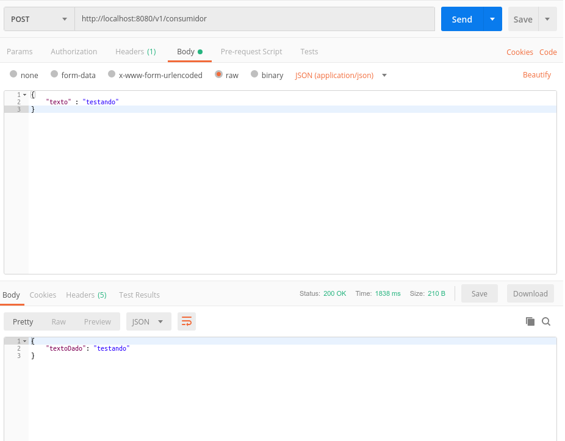

> :exclamation: Dê um feedback para esse documento no rodapé.[^1]

# Consumo de operações IIB em projetos Java


Este tutorial explica como consumir operações IIB em projetos Java com Quarkus. O consumo é feito utilizando o Curió, que permite o consumo e o provimento de operações IIB através de endpoints REST em um *sidecar* do pod na cloud, facilitando o desenvolvimento de microsserviços. Você pode encontrar uma descrição mais detalhada de como o Curió funciona na [wiki](https://fontes.intranet.bb.com.br/iib/publico/iib-container/iib-curio/iib-curio/wikis/home).

Neste exemplo utilizaremos o Curió para fazer o consumo de uma operação. Será criado um container do Curió que irá expor para o nosso microserviço um endpoint rest com o nome da operação. Este endpoint receberá como entrada um JSON contendo os campos de entrada da operação conforme contrato do catálogo. Internamente, o Curió irá converter este JSON para o formato do IIB e chamar a operação através do barramento. O Curió receberá o retorno e fará a conversão para JSON (novamente obedecendo o contrato definido no catálogo) devolvido como resposta do endpoint. Portanto, nosso microserviço precisa apenas chamar o endpoint REST exposto pelo Curió para consumir a operação.

## Configurando a dependência da operação no pom.xml

 O primeiro passo é incluir a dependência da operação IIB no arquivo `pom.xml` do seu projeto, a fim de permitir utilizar as classes de requisição e resposta da operação.

 Neste exemplo utilizamos a operação 3821497, versão 1, da sigla wbb. Ela é uma operação de eco: recebe como argumento um texto e retorna como resposta o mesmo texto.

> Recomendamos que você faça este tutorial com uma operação da sua sigla. A operação eco é usada apenas para testes e nem sempre tem algum microserviço cadastrado para provê-la, havendo grandes chances de sua aplicação receber um timeout ao tentar consumí-la.


 O xml da dependência maven pode ser obtida clicando no botão Dependência Maven:
 
 

 Inclua o xml obtido no pom do seu projeto dentro da seção ```dependencies```:

 ```xml
     <dependencies>
        ...
        <dependency>
            <groupId>br.com.bb.wbb.operacao</groupId>
            <artifactId>Op3821497-v1</artifactId>
            <version>1.9.0-SNAPSHOT</version>
        </dependency>
        ... 
    </dependency>
 ```

> Após incluir esta dependência recomendamos que você faça o reload do POM na sua IDE para que você possa utilizar os recursos de auto-complete nas classes de requisição e resposta. Você pode fazer isto com o comando ```mvn compile```.

## Configurando o Curió para criar o consumo da operação

Agora precisamos configurar o Curió para criar o endpoint REST de consumo da operação. O código abaixo contém a configuração do Curió a ser incluida no seu docker-compose. O curió será incluido na seção services e deve estar na mesma rede da sua aplicação.

> Este tutorial foi feito utilizando a versão `0.6.5` do Curió. Recomendamos que você sempre confira na [wiki](https://fontes.intranet.bb.com.br/iib/publico/iib-container/iib-curio/iib-curio/wikis/home) qual é a última versão estável. Esta pode ter parâmetros novos a serem conferidos na própria wiki. 

```yaml
version: "3.4"
services:
  minha-aplicacao:
    container_name: minha-aplicacao
  ...   
    network_mode: host
  iib-curio:
    container_name: iib-curio
    image: atf.intranet.bb.com.br:5001/bb/iib/iib-curio:0.6.5
    env_file:
      - .././.env_curio
    ports:
      - "8081:8081"
    network_mode: host
```
    
> No fragmento acima, foi utilizado um arquivo para definir as environments do curió, conforme última versão do template de projetos gerados pelo Brave. O arquivo se chama .env_curio e fica na raiz do projeto.

## Criando a interface para o consumo

O Quarkus implementa a especificação JAX-RS, facilitando o trabalho com endpoints REST.

Você deverá criar uma `interface` que conterá as assinaturas dos endpoints a serem consumidos. No nosso caso, iremos consumir um endpoint chamado POST `op3821497v1`, provido pelo Curió.

Usamos a anotação `@Path` para especificar este endpoint. As classes de requisição e resposta para a operação estão na dependência maven que importamos.

As anotações `@Produces` e `@Consumes` indicam que este endpoint recebe como requisição um JSON e retorna um JSON. O Quarkus, através da sua implementação do JAX-RS se encarregará de fazer as conversões entre o JSON e as classes Java de resposta e requisição.

```java
package br.com.bb.wbb.resources;

import javax.enterprise.context.ApplicationScoped;
import javax.ws.rs.Consumes;
import javax.ws.rs.POST;
import javax.ws.rs.Path;
import javax.ws.rs.Produces;
import javax.ws.rs.core.MediaType;

import br.com.bb.dev.erros.curio.CurioExceptionMapper;
import org.eclipse.microprofile.rest.client.annotation.RegisterProvider;
import org.eclipse.microprofile.rest.client.inject.RegisterRestClient;

import br.com.bb.wbb.operacao.echoWBBV1.bean.requisicao.DadosRequisicaoEchoWBB;
import br.com.bb.wbb.operacao.echoWBBV1.bean.resposta.DadosRespostaEchoWBB;

@RegisterRestClient
@ApplicationScoped
@Produces(MediaType.APPLICATION_JSON)
@Consumes(MediaType.APPLICATION_JSON)
@RegisterProvider(CurioExceptionMapper.class)
public interface ConsumidorCurio {

    @POST
    @Path("op3821497v1")
    DadosRespostaEchoWBB executarOperacao(DadosRequisicaoEchoWBB requisicao);

}
```
Você pode incluir varias operações nessa mesma interface, e cada operação vai seguir o mesmo padrão

```java
    @POST
    @Path("operacao-versao")
    DadosRespostaXXX executarOperacao(DadosRequisicaoXXX requisicao);
```


## Configurando o consumo REST

O Quarkus precisa, ainda, saber o endereço do servidor que está provendo o endpoint que definimos na interface. Lembre-se que iremos consumir a operação a partir do Curió, na porta 8081.  

No Quarkus a configuração é feita no arquivo `application.properties`, conforme abaixo: 

```
br.com.bb.wbb.resources.InterfaceConsumidor/mp-rest/url=http://localhost:8081
```

Esse nome da propriedade pode ser pelo nome do pacote mais o nome da interface, contudo não pode
ter mais que 64 caracteres.

Outra opção e usar o `(configKey = "curio-api")` logo apos a anotação `@RegisterRestClient` ,
E ao inves de usar o nome do pacote mais a interface, voce pode usar o nome `curio-api`, ficando assim

```
curio-api/mp-rest/url=http://localhost:8081
```

Ao incluir uma nova operação na aplicação, também é ncessário fazere a seguinte configuração para não utilizar as configurações de beans.xml do jar da operação(Substituir {sigla} pela sigla da operação. Se precisar adicionar outra exclusão basta incluir outro valor separado por vírgula):

```
# Exclusão das classes dos JAR de operações IIB da descoberta de beans CDI
quarkus.arc.exclude-types=br.com.bb.{sigla}.operacao.**
```

Para mais informações sobre essa configuração, acesse a documentação do [quarkus](https://quarkus.io/guides/cdi-reference#how-to-exclude-types-and-dependencies-from-discovery).


Observe que nas versões mais recentes de templates gerados pelo Brave, o modo de rede utilizado no `docker-compose` é o `host`. Dessa forma, o endereço do curió, tanto no ambiente local quando no Kubernetes será  `localhost:8081`. Para configurações de `docker-compose` que usem uma rede do tipo `bridge`, no lugar de `localhost` deve ser usado o nome do conteiner. 


## Fazendo o consumo da operação

Pronto. Agora que já temos tudo configurado para consumir a operação, vamos criar no nosso microserviço um endpoint que faz o consumo. No nosso exemplo faremos um endpoint `POST` bem simples chamado `consumidor`. Este endpoint receberá um texto, chamará internamente a operação IIB de eco e retornará para o usuário a resposta que este endpoint retornou.

Primeiro vamos criar um bean para mapear a nossa requisição.

```java
public class MinhaRequisicao  implements Serializable{

    private static final long serialVersionUID = 1L;

    private String texto;

    public String getTexto(){
        return this.texto; 
    }

    public void setTexto(String texto){
        this.texto = texto; 
    }
}
```

O próximo passo é criar a nossa classe que irá prover o endpoint `consumidor`. 

```java
@Consumes(MediaType.APPLICATION_JSON + ";charset=utf-8")
@Produces(MediaType.APPLICATION_JSON + ";charset=utf-8")
@Path("/v1/consumidor")
public class Consumidor {
... 
}
```

Incluimos na nossa classe a interface de consumo que criamos anteriormente. Esta deve ser incluida via anotação `@Inject` conforme abaixo: 

```java
    @Inject
    @RestClient
    ConsumidorCurio sidecarConsumidor;
```

E finalmente criamos o método com a chamada interna ao endpoint de consumo do IIB.  

```java
    @POST
    public Response consumirOperacao(MinhaRequisicao minhaRequisicao){

        DadosRequisicaoEchoWBB requisicao = new DadosRequisicaoEchoWBB(); 
        requisicao.setTextoDado(minhaRequisicao.getTexto());
        
        DadosRespostaEchoWBB resposta = sidecarConsumidor.executarOperacao(requisicao);

        return Response.status(Response.Status.OK).entity(resposta).build();
    }
```

Pronto. Agora podemos subir a nossa aplicação para testar. Chamando o endpoint POST da nossa aplicação temos o resultado abaixo: 




## Fazendo o tratamento de exceção do consumo da operação


No template de microsserviço fornecido pelo Brave, quando selecionado consumo de operações IIB, a seguinte biblioteca é adicionada ao pom.xml:
```xml
        <dependency>
	      <groupId>br.com.bb.dev</groupId>
	      <artifactId>dev-java-erro</artifactId>
	      <version>1.1.0</version>
	    </dependency>
```
Assim, ao adicionar consumo de IIB num projeto que não possua, é importannte adicionar manualmente.

É nela que está o mapper descrito na anotação
`@RegisterProvider(CurioExceptionMapper.class)` incluída nos exemplos acima.

Para acessar a documentação completa do dev-java-erro com detalhes e exemplos, [clique aqui](https://fontes.intranet.bb.com.br/dev/dev-java-erro/-/blob/master/README.md).

> Atenção: Se sua aplicação consome serviços com segurança habilitada, veja o roteiro específico sobre o assunto: [Segurança de aplicações no IIB/Curió](https://fontes.intranet.bb.com.br/idh/publico/roteiros/-/wikis/Seguran%C3%A7a-de-Aplica%C3%A7%C3%B5es-no-IIB)

# Links externos e roteiros relacionados
* [Wiki Curió](https://fontes.intranet.bb.com.br/iib/publico/iib-container/iib-curio/iib-curio/wikis/home)
* [Documentação sobre dev-java-erro](https://fontes.intranet.bb.com.br/dev/dev-java-erro/-/blob/master/README.md)
* [Segurança de aplicações no IIB/Curió](https://fontes.intranet.bb.com.br/idh/publico/roteiros/-/wikis/Seguran%C3%A7a-de-Aplica%C3%A7%C3%B5es-no-IIB)
* [Guia de referência quarkus para exclusão de tipos e dependências para discovery](https://quarkus.io/guides/cdi-reference#how-to-exclude-types-and-dependencies-from-discovery)
---
[^1]: [👍👎](http://feedback.dev.intranet.bb.com.br/?origem=roteiros&url_origem=fontes.intranet.bb.com.br/dev/publico/roteiros/-/blob/master/iib/ConsumindoOperacaoIIBJava.md&internalidade=iib/ConsumindoOperacaoIIBJava)
