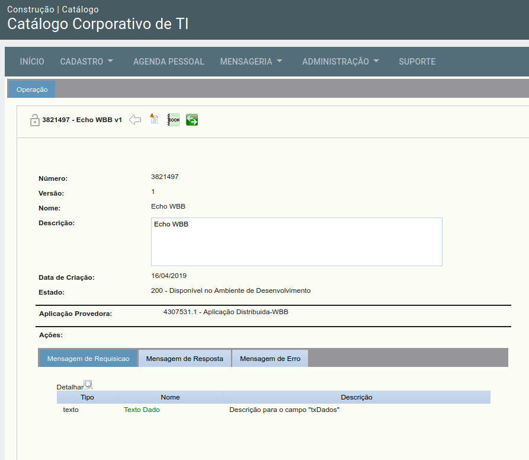
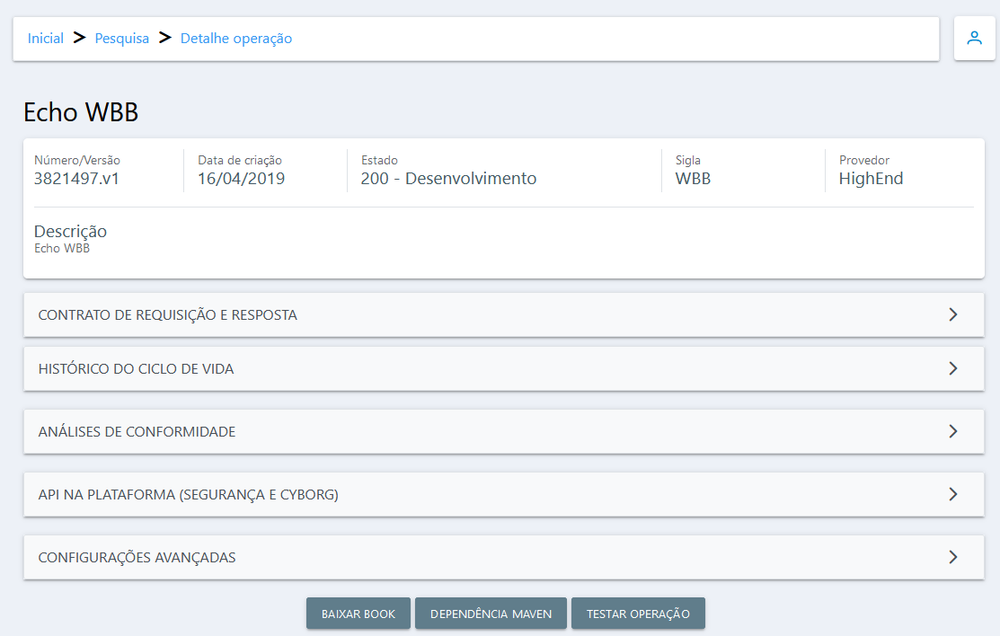
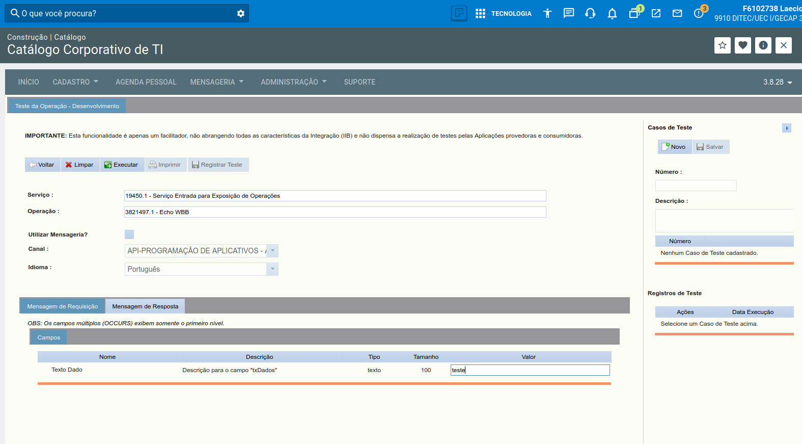
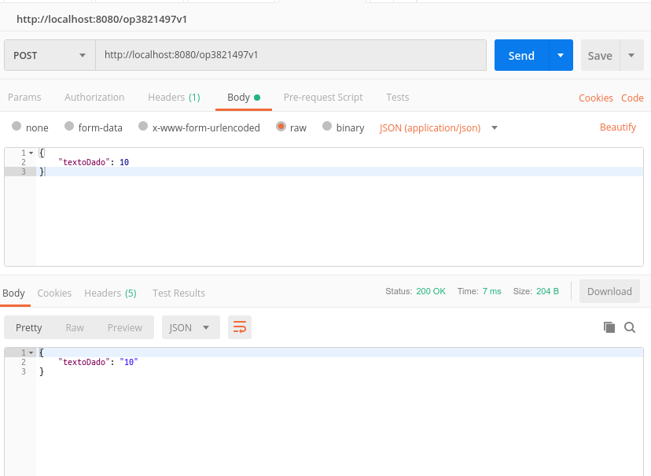

> :exclamation: Dê um feedback para esse documento no rodapé.[^1]

# Provimento de operações IIB em Java


A [funcionalidade de geração de novos projetos do Brave](https://brave.dev.intranet.bb.com.br/plan) dá suporte ao provimento de operações IIB. Este tutorial explica como funciona o provimento e serve de guia para implementar o provimento manualmente, caso não deseje incluir tardiamente o provimento ou não possa gerar o projeto pelo Brave. Para provimento em outras linguagens, favor conferir orientações na [issue #1445](https://fontes.intranet.bb.com.br/dev/publico/atendimento/issues/1445).

O provimento da operação é feito utilizando o Curió, um conteiner que inicia no mesmo pod da sua aplicação, quanndo connfigurado. Para prover uma operação utilizando o Curió, o seu projeto deverá ter um endpoint `POST` com o nome e versão da operação no formato op{numero-operacao}v{versao-operacao}(ex: op3821497v1), que receba como entrada um JSON com os dados da requisição e posteriormente devolva um JSON com os dados de resposta, conforme cadastrado no Catálogo de Operações. Recomendamos que seja feita a leitura da [WIKI do Curió](https://fontes.intranet.bb.com.br/iib/publico/iib-container/iib-curio/iib-curio/wikis/home) para entender melhor o seu funcionamento e qual versão deve ser utilizada, bem como os parâmetros dela. Este tutorial se baseia na versão 0.6.5.

**Consultar sua operação no catálogo:**
[Plataforma de Tecnologia](https://plataforma.atendimento.bb.com.br:49286/estatico/gaw/app/spas/index/index.app.html?cd_modo_uso=19#/), Construção --> Catálogo Corporativo de TI --> Menu: Cadastro, selecionar Operação(inserir o número da operação) --> Propriedades. 

# IMPORTANTE: Produtos de mensageria usados pelas operações IIB:
* As operações devem estar configuradas como **Provimento High End** para que possam ser providas via container no Arq3;
* **Transporte EMS** - O catálogo já seta o transporte como EMS por padrão a partir de julho/2020. Sempre preferir EMS;
* Transporte fila MQ - É possível prover utilizando o transporte fila MQ;
* Operações CICS nativas - Atualmente não estão sendo criadas novas rotas de operações CICS tradicionais em produção;
* Rendezvous - Não deve-se utilizar Rendezvous no provimento de operações na Cloud atualmente, mas caso você possua uma operação com este transporte:

    1.  **Fluxo recomendado**: Criar nova operação tipo EMS HighEnd;

    2.  Ou alternativamente: Pedir alteração do transporte da operação atual(de Rendezvous para EMS), compatibilizando a operação:
        2.1 - Depende de análise - cada caso é diferente;
        2.2 - Abrir issue solicitando análise em: [link-abrir-issue-aqui](https://fontes.intranet.bb.com.br/dev/publico/atendimento/-/issues)
            2.2.1 - Ao abrir a issue, sempre utilizar o template padrao fornecido;
            2.2.2 - Citar dentro da issue  ESTE roteiro para referência de todosos intervenientes, ou mesmo para atualização de novas informações;


## Criando a operação no catálogo 

O primeiro passo é criar a operação (ou versionar uma já existente). As instruções para uso do catálogo estão disponíveis no link abaixo: 

[Manual Catalogo](https://fontes.intranet.bb.com.br/ctl/publico/atendimento/-/wikis/Cat%C3%A1logo-de-Opera%C3%A7%C3%B5es)

As operações devem estar configuradas como **Provimento High End** para que possa ser provida via container. 

## Configurando dependência pom da operação 

 O primeiro passo é incluir a dependência da operação IIB no arquivo pom.xml do seu projeto, a fim de permitir utilizar as classes de requisição e resposta da operação.

 Neste exemplo utilizamos a operação 3821497, versão 1, do WBB. Ela é uma operação de echo, que recebe como argumento um texto e retorna como resposta o mesmo texto.

Antigo


Novo Catalogo


 O xml da dependência maven pode ser obtida no catálogo clicando no botão Dependência Maven:
 
Antigo
 

Novo


 Inclua o xml obtido no pom do seu projeto dentro da seção ```dependencies```:

 ```xml
     <dependencies>
        ...
        <dependency>
            <groupId>br.com.bb.wbb.operacao</groupId>
            <artifactId>Op3821497-v1</artifactId>
            <version>1.9.0-SNAPSHOT</version>
        </dependency>
        ... 
    </dependency>
 ```

> Após incluir esta dependência, recomendamos que você faça o reload do POM na sua IDE para que você possa utilizar os recursos de auto-complete nas classes de requisição e resposta. Você pode fazer isto com o comando ```mvn compile```.

## Criando a classe para o provimento da operação

O próximo passo é criar a classe que vai fazer o provimento da operação. Conforme abaixo, o recurso deve ser definido para consumir e prover JSON. O Path deve ser definido no formato op`numero-operacao`v`versao-operacao` para que ser chamado pelo Curió.

```java

import javax.ws.rs.Consumes;
import javax.ws.rs.Path;
import javax.ws.rs.Produces;
import javax.ws.rs.core.MediaType;

... 

@Consumes(MediaType.APPLICATION_JSON + ";charset=utf-8")
@Produces(MediaType.APPLICATION_JSON + ";charset=utf-8")
@Path("/op3821497v1")
public class Op3821497v1 {
...
}
```

Crie então o método responsável por atender as requisições POST conforme abaixo. Os parâmetros de entrada e de saída serão a classe de requisição e resposta contidas no jar da operação. 

No método servir apresentado sugerimos que a lógica seja feita por dois métodos: 
1.  ```validarEntrada``` - responsável por validar se cada campo da entrada atende ao esperado;
2.  ```tratarRequisicao``` -  responsável pela lógica de negócio. 

```java
import javax.ws.rs.POST;

import br.com.bb.wbb.operacao.echoWBBV1.bean.requisicao.DadosRequisicaoEchoWBB;
import br.com.bb.wbb.operacao.echoWBBV1.bean.resposta.DadosRespostaEchoWBB;

...

    @POST
    public DadosRespostaEchoWBB servir(DadosRequisicaoEchoWBB requisicao) throws ErroNegocialException {

        validarEntrada(requisicao);

        DadosRespostaEchoWBB resposta = tratarRequisicao(requisicao);

        return resposta;
    }
```

No ```validarEntrada``` verificamos apenas se o único campo da nossa requisição (```textoDado```) está preenchido com um valor diferente de espaços. Caso não esteja, lançaremos uma ```ErroNegocialException``` com uma mensagem. ```TextoNaoInformadoException``` é uma classe do nosso sistema que herda de ```BBException```, conforme descrito pela biblioteca [dev-java-erro](https://fontes.intranet.bb.com.br/dev/dev-java-erro).

```java
    private void validarEntrada(DadosRequisicaoEchoWBB requisicao) throws ErroNegocialException{

        if(requisicao.getTextoDado().equals("")){
            throw new TextoNaoInformadoException();
        }

    }
```

Para fins didáticos, um exemplo curto de como poderia ser a classe ```TextoNaoInformadoException```:

```java

import br.com.bb.dev.erros.exceptions. BBException;

public class TextoNaoInformadoException extends BBException {

  public TextoNaoInformadoException() {
    super("015", "Texto de entrada não informado");
  }


```

No ```tratarRequisicao``` abaixo, apenas setamos o campo da entrada na resposta, conforme comportamento esperado da nossa operação.

```java
    private DadosRespostaEchoWBB tratarRequisicao(DadosRequisicaoEchoWBB requisicao) throws ErroNegocialException{
        
        DadosRespostaEchoWBB resposta = new DadosRespostaEchoWBB();

        resposta.setTextoDado(requisicao.getTextoDado());
        
        return resposta;
    }
```

## Configurando o docker-compose para fazer o provimento via Curió em ambiente local 

Para testar o provimento da operação local, o curió deve ser incluído no docker-compose, conforme exemplo abaixo. Na variável ```CURIO_OP_PROVEDOR``` devem ser incluidos os valores da dependência maven, separados por `:` (dois pontos). Caso haja mais de uma operação a ser provida, separe por `|` (barra). Observe que o container do seu microserviço e o do curió devem estar na mesma rede.

```yaml
version: "3.4"
services:
  dev-core-java:
    container_name: dev-core-java  
  ... 
    network_mode: host 
  iib-curio:
    container_name: iib-curio
    image: atf.intranet.bb.com.br:5001/bb/iib/iib-curio:0.6.5
    # as enviroments estarão presentes no arquivo .env_curio na raiz do projeto, voce deve alterar la as configuracoes
    env_file:
      - .././.env_curio
    # se windows, alterar abaixo as portas 8081 e também na variável KUMULUZEE_SERVER_HTTP_PORT para 8090 por exemplo
    # pois a porta 8081 no windows pode já estar ocupada por outros serviços
    ports:
      - "8081:8081"
    network_mode: host

```

Após subir o projeto na sua máquina (seja via docker-compose up ou via script run.sh), o curió irá se registrar no iib de desenvolvimento provendo a operação a partir da sua máquina. Os testes poderão então ser feitos a partir do catálogo de operações, conforme ilustrado abaixo. Caso haja mais de uma máquina provendo a operação, as requisições serão escalonadas usando estratégia round-robin.



Os testes da sua implementação da operação também podem ser feitos diretamente no endpoint REST gerado pelo seu microserviço, sem passar pelo Curió, conforme ilustrado na figura abaixo.



## Fazer o provimento via Curió em ambiente local usando Docker

Também é possível usar o Curió em ambiente local sem precisar utilizar o docker-compose. Para subir um conteiner de curió em modo ```host``` com as operações cadastradas na sua aplicação, execute:

```shell
docker run -p 8081:8081 --env-file "$PWD"/.env_curio --name CURIO --rm atf.intranet.bb.com.br:5001/bb/iib/iib-curio:0.6.5
```

O arquivo .env_curio é gerado junto com seu template de projeto(para projetos gerados na versão 2+ do [archetype](https://fontes.intranet.bb.com.br/dev/dev-archetype-quarkus)). Caso os dados de provimento ou consumo mudem, esse arquivo deve ser atualizado.

Fazendo dessa forma, o endereço a ser configurado do curió na aplicação é ```localhost:8081```.
---
[^1]: [👍👎](http://feedback.dev.intranet.bb.com.br/?origem=roteiros&url_origem=fontes.intranet.bb.com.br/dev/publico/roteiros/-/blob/master/iib/ProvendoOperacaoIIBJava.md&internalidade=iib/ProvendoOperacaoIIBJava)
